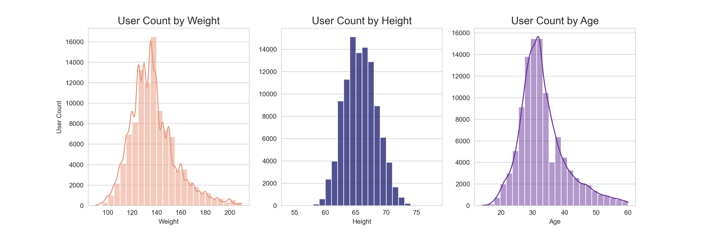
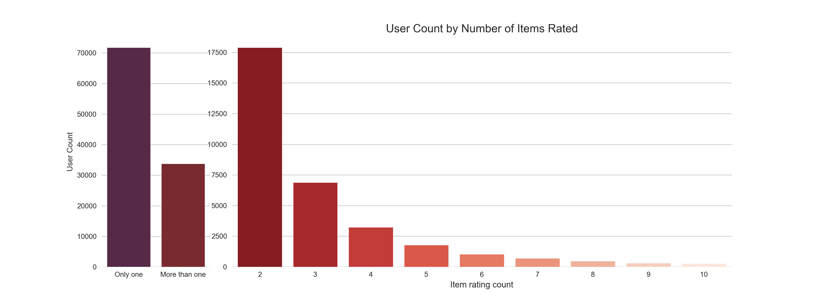
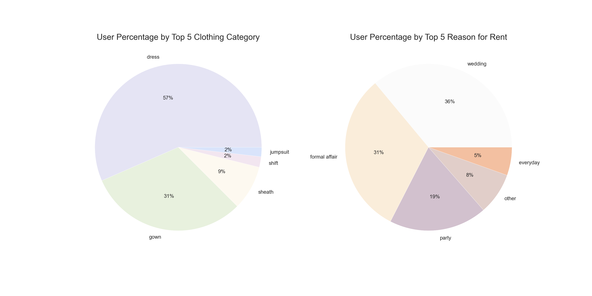
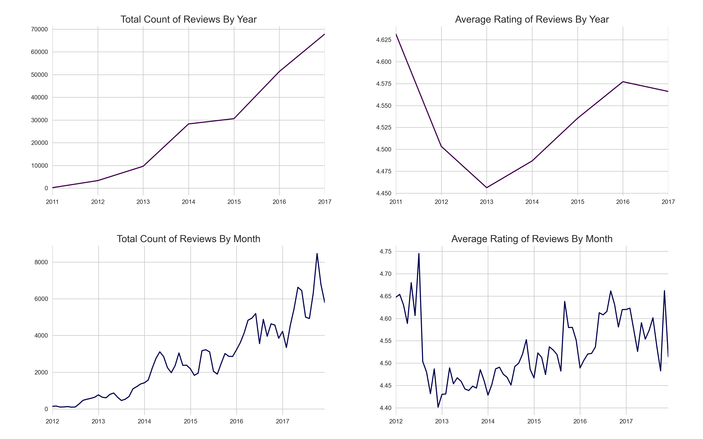

# Retail Product Recommender Engine

## Overview

A recommender engine is developed to increase revenue of clothing rental companies by predicting user preferences and recommending products for users to rent. An analysis of about 200,000 product reviews at Rent the Runway is performed to understand the users. Generalized and personalized recommendations are generated by the different algorithms I applied: the content-based recommenders created similar item recommendations based on item features such as user reviews describing the items, and the collaborative filtering systems predicted user ratings to provide recommendations accordingly. On a 5 point rating scale, the Singular Value Decomposition algorithm attained 0.5 mean absolute error.

## Business Problem

The clothing rental industry grows as more companies follow suit of the retailer Rent the Runway, which pioneered online services and subscriptions for designer rentals. To help grow the revenue of clothing rental companies, I develop recommendation systems that recommend retail products for users to rent. Doing so will expose users to relevant products that tailor to their preferences. Using Rent the Runway data, I conduct an analysis of the product reviews, model data to predict ratings, and provide recommendations accordingly.

## Data Understanding

The Rent the Runway reviews ([data source](https://cseweb.ucsd.edu/~jmcauley/datasets.html#clothing_fit)) contain 200,000 ratings of 6,000 unique items rented between 2010 and 2018 by over 100,000 unique users. To clean the data, I take the following pre-processing steps:
- Drop missing values of the target variable `rating`.
- Impute missing values of the other variables.
  - Median for numerical features.
  - Mode for categorical features.
- Perform feature engineering.
- Create two additional dataframes.
  - Group the data by `user_id`
  - Group the data by `item_id`.

**Data Visualization:**

Normally distributed and diverse ranges of weight, height, and age above.
***

Overall, two thirds of users rented only one item and the remaining third rented more than one, on the left chart. Majority of those who rented more than once rented exactly two items, on the right chart.
***

The most common clothing categories are dresses and gowns that align with the most common reasons for renting which are for wedding, formal affair, and party.
***

**Time Series:**

- The count of reviews increased over the years from 10,000 in 2013 to almost 70,000 by 2018.
- The count of reviews peak during months of spring and fall with the highest spike of over 8,000 reviews in October of 2017.
- The average ratings steadily increased from over 4.45 in 2013 to 4.575 in 2016 but went down by less then 0.025 in 2017.
- The average ratings peak during the latter months of the year and aligned with the higher counts of rentals in the fall.

## Recommendation Systems

First, I create a set of generalized recommendations based on all items, calculate their weighted ratings, and return the top 10 highest-rated items across the board. To simulate the online shopping experience, I can filter based on data features too, like `wedding` for event. Next, I  **personalize the recommendations** by applying different algorithms for *Content-Based Recommenders* and *Collaborative Filtering Systems*.

### Content-Based Recommenders

Content-based recommenders are based on the idea that if a user likes an item, the user will also like items similar to it. To measure the similarity between the items, I calculate the Pearson correlation using their numerical and categorical features. Then, I construct a `similarity_matrix` of all items to generate the content-based recommendations for any `item_id`. 

To take it a step further, I use the text features to create a **Text Review-Based Recommender** too using Natural Language Processing to:
- Clean the text by removing stopwords and performing lemmatization.
- Create the Term Frequency-Inverse Document Frequency (TF-IDF) vectors for the *documents*, which are the reviews.
- Compute the pairwise cosine similarity from the matrix of TF-IDF scores, given by the dot product between each TF-IDF vector.

**Some differences** between the text-based recommendations and the content-based recommendations on the same item:

|Feature|Content-based|Text-based|Item|
|---|:---:|:---:|:---:|
|**rating_average**|4.38 - 4.69|4.43 - 4.77|4.40|
|**rented_for_top**|party, formal affair, wedding|formal affair (across the board)|formal affair|
|**body_type_top**|hourglass, athlete|hourglass (across the board)|hourglass|
|**category_top**|dress, gown, sheath|gown (across the board)|gown|

### Collaborative Filtering Systems

Collaborative filtering systems recommend items to a user based on the user's past ratings *and* on the past ratings and preferences of other similar users. I apply the different implementations of collaborative filtering recommendation systems using the Python library [`surprise`](https://surprise.readthedocs.io/en/stable/index.html):

|Prediction Algorithm|Description|
|:---|:---|
|[Normal Predictor](https://surprise.readthedocs.io/en/stable/basic_algorithms.html#surprise.prediction_algorithms.random_pred.NormalPredictor)|Algorithm predicting a random rating based on the distribution of the training set, which is assumed to be normal.
|[Baseline Only](https://surprise.readthedocs.io/en/stable/basic_algorithms.html#surprise.prediction_algorithms.baseline_only.BaselineOnly)|Algorithm predicting the baseline estimate for given user and item.|
|[KNN Basic](https://surprise.readthedocs.io/en/stable/knn_inspired.html#surprise.prediction_algorithms.knns.KNNBasic)|A basic collaborative filtering algorithm.|
|[KNN Baseline](https://surprise.readthedocs.io/en/stable/knn_inspired.html#surprise.prediction_algorithms.knns.KNNBaseline)|A basic collaborative filtering algorithm, taking into account the mean ratings of each user.|
|[KNN with Means](https://surprise.readthedocs.io/en/stable/knn_inspired.html#surprise.prediction_algorithms.knns.KNNWithMeans)|A basic collaborative filtering algorithm, taking into account the z-score normalization of each user.|
|[KNN with Z-Score](https://surprise.readthedocs.io/en/stable/knn_inspired.html#surprise.prediction_algorithms.knns.KNNWithZScore)|A basic collaborative filtering algorithm taking into account a *baseline* rating.
|[Single Value Decomposition](https://surprise.readthedocs.io/en/stable/matrix_factorization.html#surprise.prediction_algorithms.matrix_factorization.SVD)|The famous SVD algorithm, as popularized by Simon Funk during the Netflix Prize. When baselines are not used, this is equivalent to Probabilistic Matrix Factorization.|
|[Single Value Decomposition ++](https://surprise.readthedocs.io/en/stable/matrix_factorization.html#surprise.prediction_algorithms.matrix_factorization.SVDpp)|The SVD++ algorithm, an extension of SVD taking into account implicit ratings.|
|[Non-Negative Matrix Factorization](https://surprise.readthedocs.io/en/stable/matrix_factorization.html#surprise.prediction_algorithms.matrix_factorization.NMF)|A collaborative filtering algorithm based on Non-negative Matrix Factorization.|
|[SlopeOne](https://surprise.readthedocs.io/en/stable/slope_one.html#surprise.prediction_algorithms.slope_one.SlopeOne)|A simple yet accurate collaborative filtering algorithm.|
|[CoClustering](https://surprise.readthedocs.io/en/stable/co_clustering.html#surprise.prediction_algorithms.co_clustering.CoClustering)|A collaborative filtering algorithm based on co-clustering.|

## Results and Recommendations

**Systems Performance:**

To evaluate the recommendation systems, I use the mean absolute error which measures the difference between the rating predicted by the model and the actual rating by the user. The results show that the tuned Singular Value Decomposition algorithm attains the lowest Mean Absolute Error of 0.5302 on the 5 point rating scale.

***
SOURCE CODE: [Main Notebook](https://github.com/czarinagluna/retail-product-recommender-engine/blob/main/main.ipynb)

# Contact

Feel free to contact me for any questions and connect with me on [Linkedin](https://www.linkedin.com/in/czarinagluna/).
