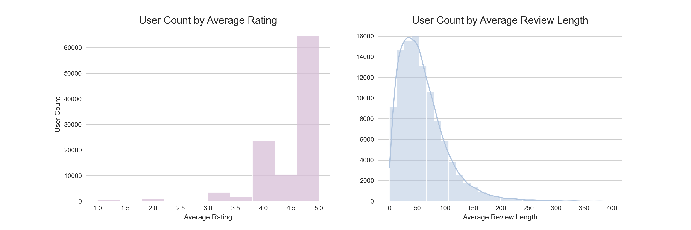
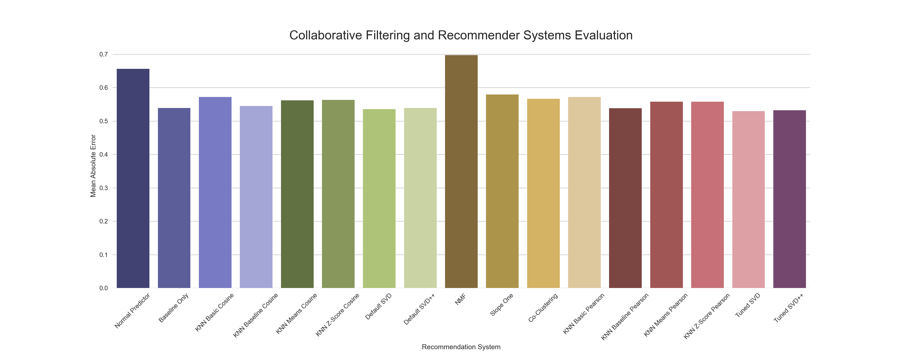

# Retail Product Recommender Engine

## Overview

Write here.

## Business Problem

The clothing rental industry grows as more companies follow suit of the retailer Rent the Runway, which pioneered online services and subscriptions for designer rentals. To help grow the revenue of clothing rental companies, I develop recommendation systems that predict a set of user preferences and recommend the top preferences for the user. Doing so will conveniently expose users to relevant products to rent that tailor to their preferences. Using data from  Rent the Runway, I conduct an analysis of the product reviews, model the data to predict user ratings, and provide recommendations accordingly.

## Data Understanding

The Rent the Runway reviews ([data source](https://cseweb.ucsd.edu/~jmcauley/datasets.html#clothing_fit)) contain 200,000 ratings of 6,000 unique items rented between 2010 and 2018 by over 100,000 unique users.

**Exploratory Data Analysis**

## Recommendation Systems

To start, I create a set of generalized recommendations based on all the data. I calculate a weighted rating for all items using Bayesian average, and return the top 10 highest-rated items across the board. To simulate the online shopping experience, I can also filter the popularity-based recommendations on data features like `dress` for clothing category. To **personalize the recommendations**, I apply the different algorithms for Content-Based Recommenders and Collaborative Filtering Systems.

### Content-Based Recommenders

Content-based recommendation systems are based on the idea that if a user likes an item, the user will also like  items similar to it. To measure the similarity between the items, I calculate the Pearson correlation using numerical and categorical features from the table `item_data` created earlier. Then, I complete a `similarity_matrix` of all the items to use in the function `content_based_similarity` I define, which generates content-based recommendations for any `item_id`. To add, I use the text features to create a text review-based recommender as well using Natural Language Processing.

**Text Review-Based Recommender**

To recommend items based on text reviews, Natural Language Processing (NLP) is used to:
- Clean the text by removing stopwords and performing lemmatization.
- Create the Term Frequency-Inverse Document Frequency (TF-IDF) vectors for the *documents*, which are the reviews.
- Compute the pairwise cosine similarity from the constructed matrix of TF-IDF scores.

To compute the cosine similarity score between the text reviews, the dot product between each TF-IDF vector is calculated in the function `text_based_recommendation`.

**Key Differences** between the text-based recommendations and the content-based recommendations on the same item:

|Feature|Content-based|Text-based|Item|
|---|---|---:|:---|
|rating_average|4.38 - 4.69|4.43 - 4.77|4.40|
|rented_for_top|party, formal affair, wedding|formal affair (across the board)|formal affair|
|body_type_top|hourglass, athlete|hourglass (across the board)|hourglass|
|category_top|dress, gown, sheath|gown (across the board)|gown|

***

### Collaborative Filtering Systems

Collaborative filtering systems recommend items to a user based on the user's past ratings *and* on the past ratings and preferences of other similar users. I apply the different implementations of collaborative filtering recommendation systems using the Python library [`surprise`](https://surprise.readthedocs.io/en/stable/index.html):

## Results and Recommendations

**Systems Performance:**

Write here.

**Model Deployment**

Write here.

***
SOURCE CODE: [Main Notebook](https://github.com/czarinagluna/retail-product-recommender-engine/blob/main/main.ipynb)

# Contact

Feel free to contact me for any questions and connect with me on [Linkedin](https://www.linkedin.com/in/czarinagluna/).
